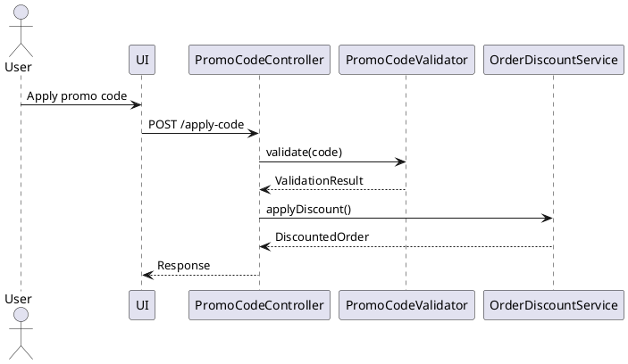

## Requirement Assessment

[What needs to be built - be specific about the end state and desires]

### Why

- [Business value and user impact]
- [How this feature enhances the product]
- [Problems this solves and for whom]
- ...

### What

- [User-visible behavior and technical requirements]
- ...

### Success Criteria

- [ ] [Specific measurable outcomes]
- [ ] ...

## Solution Approach

### Constraints

List all relevant constraints that impact the design and implementation. These can include:

- [Technical Constraints (e.g. programming languages, frameworks, platforms, or libraries that must be used; performance or memory constraints; compliance with specific protocols or standards)]
- [Organizational Constraints (e.g. coding standards, deployment environment restrictions)]
- [Regulatory/Policy Constraints (e.g. security or privacy regulations, industry standards that the solution must adhere to)]

Note: For each constraint, briefly explain how it limits or influences the solution. Categorize constraints if helpful (technical, business, etc.).

### Context and Scope

Provide all contextual information required to implement this feature in a single attempt. Include:

Description of how the feature fits into the overall system

- What is in scope and out of scope
- Target directory or module for the implementation
- List of related files and their role
- Relevant documentation links (API guides, data schemas, design docs)
- Environment and language assumptions (e.g., Node.js 18, Docker, Python 3.11)
- Coding conventions and patterns to follow

```yaml
# CRITICAL: Include this in your context window
- file: path/to/file.js
  why: [Specific section affected by the change or relevance to the feature]

- doc: path/to/documentation.md
  why: [Specific key insight relevant for the implementation]

- url: https://link.com/to/page.html
  why: [Pattern to follow, API to integrate, repository of library to use]
```

### Solution Strategy

Summarize the core approach to the solution.

- [Architecture Pattern: Describe the approach (e.g., layered, modular, microservice)]
- [Integration Approach: Describe how this feature integrates with the current system architecture]
- [Justification: Brief rationale for why this approach fits given the constraints and scope]
- ...

### Building Block View

Component Responsibilities:

- List major modules and their purposes using plain markdown. For detailed interfaces, use pseudocode where appropriate.

```typescript
// Example (TypeScript-like pseudocode)
type PromoCodeValidator {
    validate(code: string): ValidationResult
}
```

Directory structure:

- Present current and target codebase structure as a tree.

```bash
/src
  /controllers
    OrderController.ts      # Modified
    PromoCodeController.ts  # New
  /services
    OrderDiscountService.ts # New
  /models
    Order.ts                # Modified
    PromoCode.ts            # New
```

Data Models:

- Use pseudocode or schema-style formats to define new data models or updates.

```typescript
type PromoCode = {
  code: string;
  validUntil: Date;
  discountPercent: number;
  usageLimit: number;
};
```

### Runtime View

Describe runtime behavior using sequential flow or state interactions.

- Scenario Name: e.g., "User applies promo code"
- Trigger: What initiates the flow?
- Steps: Describe interaction step-by-step between components.
- Error/Alternate Flows: Mention exceptional or failure paths.



For complex logic, include pseudocode:
```typescript
// Example algorithm for complex business logic
function calculateDiscount(order, promoCode) {
  // 1. Validate promo code eligibility
  // 2. Calculate base discount
  // 3. Apply tier multipliers
  // 4. Check maximum discount limits
  // 5. Return final discount amount
}
```

### Deployment View

- [Deployment Context: Describe if deployed in an existing app, new service, serverless function, etc]
- [Environment Configuration: Note required settings, credentials, or env vars]
- [Infrastructure Components: E.g., new database table, cache instance, job scheduler]
- [Scaling/Resilience Considerations: Mention load handling, failover, autoscaling if applicable]

### Cross-Cutting Concepts

List shared policies or behaviors across the solution:

- [Security: Authentication, authorization, encryption]
- [Error Handling: Global vs local strategies]
- [Performance Optimization: Caching, batching, async patterns]
- [i18n/L10n: Support for multi-language or regional content]
- [Logging/Auditing: System observability practices]

#### Implementation Patterns

Provide concrete examples from the codebase without being overly prescriptive:

##### Common Import Patterns
```typescript
// Example imports from similar features
import { ComponentType } from "@/components/ui/component"
import { useFeatureHook } from "@/hooks/useFeature"
```

##### Component Structure Pattern
```typescript
// Example structure from existing components
export function FeatureComponent({ prop }: Props) {
  // Hook usage pattern
  // Render pattern
}
```

##### Error Handling Pattern
```typescript
// Common error handling approach
try {
  // Operation
} catch (error) {
  // Error handling pattern used in codebase
}
```

#### Implementation Hints

Provide guidance without constraining the implementation:

- **Starting Point**: [Which file/component to begin with]
- **Key Patterns**: [Important patterns to follow from existing code]
- **Common Pitfalls**: [Known issues to avoid based on codebase analysis]
- **Integration Points**: [Where this feature connects with the system]

### Architecture Decisions

List decisions and their reasoning:

- [ ] [Use centralized PromoCodeValidator, because it promotes reuse and reduces duplication]
- [ ] ...

### Quality Requirements

State quality attributes the solution must meet

- [Performance: Specific, measurable targets that can be validated]
- [Usability: User experience requirements]
- [Security: Access control and data protection needs]
- [Reliability: Error handling and recovery requirements]
- ...

Note: Only include requirements that can be validated within the current infrastructure.

### Test Specifications

Define specific test scenarios with expected behaviors. Tests should verify actual functionality, not just code existence.

#### Component Tests (if applicable)
```typescript
// Example: Story Detail Page Component
test("renders story content when story data is loaded", async () => {
  // Setup: Mock the story data and render component with router context
  // Action: Wait for content to load
  // Assert: Verify story title, chapters, and navigation elements are displayed
});

test("handles missing story with user-friendly error", async () => {
  // Setup: Mock 404 response from API
  // Action: Render component with invalid story ID
  // Assert: Error message is displayed, navigation options available
});
```

#### Hook/Logic Tests
```typescript
// Example: useStoryDetail hook
test("fetches and returns story data", async () => {
  // Setup: Mock successful API response
  // Action: Call hook with story ID
  // Assert: Returns loading state, then data, no error
});

test("handles concurrent story fetches correctly", async () => {
  // Setup: Mock API with delays
  // Action: Change story ID while first fetch is pending
  // Assert: Only latest fetch result is used
});
```

#### Integration Tests
```typescript
// Example: Story Navigation Flow
test("navigates between chapters using keyboard shortcuts", async () => {
  // Setup: Render story with multiple chapters
  // Action: Simulate arrow key presses
  // Assert: Chapter changes, URL updates, progress tracked
});
```

**Test Coverage Requirements:**
- All happy paths (successful operations)
- Error states (network failures, invalid data)
- Edge cases (empty data, boundary values)
- Loading and transition states
- User interactions (if UI component)
- Accessibility requirements (if applicable)

## Implementation Checklist

Break down the implementation into clear, executable tasks. Order tasks logically for implementation flow.

**Checkbox Usage During Execution:**
- [ ] = not started
- [~] = in progress (currently working on)
- [x] = completed (validated and working)

**Task Format:**
- Write actionable tasks that can be executed independently
- Include subtasks for complex items
- Note dependencies between tasks
- Include validation command after each major task

Structure tasks by logical areas using consistent heading levels:

```markdown
### [Component/Module Group]

- [ ] Main task description
  - [ ] Subtask 1
  - [ ] Subtask 2
  - [ ] ...
  - [ ] Validation: Run relevant tests

- [ ] Another task
  - [ ] ...

### Tests

- [ ] Unit test implementation
  - [ ] Test setup (mocks, providers, test data)
  - [ ] Core functionality tests
  - [ ] Edge case handling
  - [ ] Error scenarios
  - [ ] Validation: Run test suite

- [ ] Integration tests (if applicable)
  - [ ] User flow testing
  - [ ] Component interaction
  - [ ] State management
  - [ ] Validation: Run test suite

### Documentation

- [ ] Update relevant documentation
- [ ] ...
```

## Implementation Validation

This section defines multi-level validation to ensure the implementation meets the documented solution approach. Each level builds upon the previous and can be executed sequentially or in parallel by validation agents.

### Level 1 – Structural Completeness

- [ ] Confirm all tasks in the implementation checklist are marked complete
- [ ] Verify each referenced file/module exists in the codebase
- [ ] Check that directory structure matches the target layout

### Level 2 – Interface and Data Contract Validation

- [ ] Verify interfaces match described method signatures
- [ ] Check that all schemas match examples in the document
- [ ] Validate that the correct models were extended/created

### Level 3 – Runtime Behavior Simulation

- [ ] Type checking is successful
- [ ] Code linting is successful
- [ ] Code formatting is consistent
- [ ] All tests pass
- [ ] Build completes without errors
- [ ] No runtime errors detected
- [ ] All automated test cases implemented and passing

### Level 4 – Quality Attribute Verification

- [ ] Performance: Does the system meet response time/load expectations?
- [ ] Security: Are all access controls and data protection mechanisms in place?
- [ ] Usability: Are user-facing messages clear and localized if needed?

### Level 5 – Design Alignment and Standards Compliance

- [ ] Review if the implementation follows team architectural patterns
- [ ] Confirm naming conventions, folder structure, and test coverage thresholds
- [ ] Identify any drift from previously made architectural decisions

---

## Anti-Patterns to Avoid

- ❌ Don't create new patterns when existing ones work
- ❌ Don't skip validation because "it should work"
- ❌ Don't ignore failing tests - fix them
- ❌ Don't hardcode values that should be config
- ❌ Don't catch all exceptions - be specific
