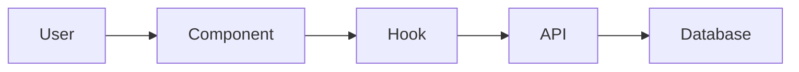
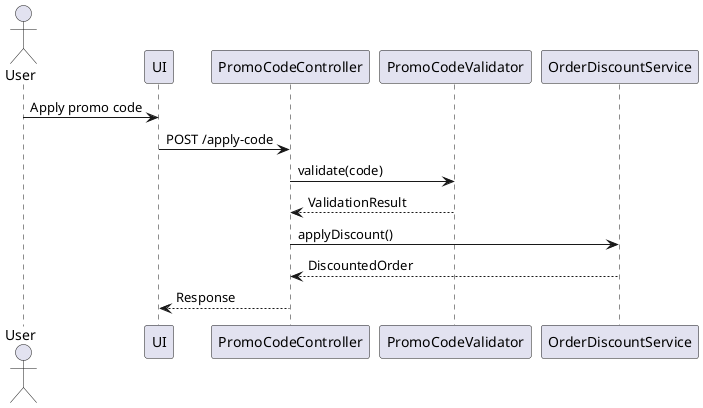

---
prd_version: 1.0
feature_id: [3-digit-number]
feature_title: [kebab-case-feature-name]
estimated_complexity: [low|medium|high]
confidence_score: [percentage]
confidence_summary: "[Brief explanation of confidence level]"
pending_decisions: "[List key decisions needing user input, or 'none']"
context_priority: [critical|high|medium|low]
retrieval_tags: [tag1, tag2, tag3]
dependencies: [feature-id1, feature-id2]
implemented_at: null
---

## Problem Definition

### What Problem Are We Solving?
[2-3 sentences maximum describing the core problem]

### Who Is Affected?
- Primary users: [specific user segment]
- Impact: [quantifiable if possible]

### Why Now?
[Business driver or trigger event]

### Success Looks Like
- [ ] [Specific, measurable outcome]
- [ ] [User-observable change]
- [ ] [Business metric improvement]

## Context Assembly Guide

*[INSTRUCTION: Use Claude Code's @ notation for easy file navigation, or relative paths from project root. This note should not appear in the final PRD.]*

### Critical Context (Must Read First)
```yaml
- file: @src/components/critical/file.ts
  relevance: CRITICAL
  sections: [lines 50-100, function processOrder]
  why: "Core business logic that must be preserved"
  
# Alternative: relative path format
- file: ./src/components/critical/file.ts
  relevance: CRITICAL
  sections: [lines 50-100, function processOrder]
  why: "Core business logic that must be preserved"
```

### Supporting Context (Read as Needed)
```yaml
- doc: @docs/patterns/auth-flow.md
  relevance: MEDIUM
  why: "Follow this authentication pattern"
  
- url: https://docs.library.com/api
  relevance: LOW
  why: "Reference if using advanced features"
```

### Context Boundaries
- **In Scope**: [What this feature will change]
- **Out of Scope**: [What this feature will NOT touch]
- **Do Not Modify**: [Critical files/systems to avoid]

## Solution Approach

### Constraints

- [Technical, e.g. Language/framework requirements, performance targets]
- [Organizational, e.g. Coding standards, deployment restrictions]
- [Security/Compliance, e.g. Auth requirements, data protection needs]

### Project Commands

*[INSTRUCTION: These commands will be discovered during codebase analysis and populated by the create command. This note should not appear in the final PRD.]*

```bash
# Environment Setup
Install Dependencies: [project-specific install command]
Environment Setup: [additional setup steps if needed]
Start Development: [development server command]

# Validation (run after each phase)
Code Quality: [linting/formatting command] 
Type Safety: [type checking command, if applicable]
Run Tests: [test execution command]
Build Project: [build/compile command]

# Database (if applicable)
Database Migration: [migration command]
Database Seed: [test data setup command]

# Additional Project-Specific Commands
[Any other relevant commands discovered in the codebase]
```

*[INSTRUCTION: The execute command should run these validation commands after each implementation phase to ensure code quality and catch issues early. This note should not appear in the final PRD.]*

### Solution Strategy

- [Architecture Pattern, e.g. Describe the approach (e.g., layered, modular, microservice)]
- [Integration Approach, e.g. Describe how this feature integrates with the current system architecture]
- [Justification, e.g. Brief rationale for why this approach fits given the constraints and scope]
- ...

### Building Block View

#### Components



#### Directory Map

```
.
├── src/
│   ├── feature_area/
│   │   ├── main_component          # NEW: Primary feature logic
│   │   ├── data_models            # MODIFY: Extend existing models
│   │   ├── business_logic         # NEW: Core processing logic
│   │   └── integration_layer      # NEW: External service connections
│   └── shared/
│       ├── utilities              # MODIFY: Add shared functions
│       └── types                  # NEW: Shared type definitions
```

*[INSTRUCTION: Actual paths and file names will be determined based on project conventions discovered during implementation. This note should not appear in the final PRD.]*

### Interface Specifications (Internal Changes Only)

*[INSTRUCTION: Include this section only when the feature involves changes to data structures, internal APIs, or core application interfaces. This note should not appear in the final PRD.]*

#### Data Storage Changes
```yaml
# Database/storage schema modifications
Table: primary_entity_table
  ADD COLUMN: new_field (data_type, constraints)
  MODIFY COLUMN: existing_field (new_constraints) 
  ADD INDEX: performance_index (fields)

Table: supporting_entity_table (NEW)
  id: primary_key
  related_id: foreign_key
  business_field: data_type, constraints
```

#### Internal API Changes
```yaml
# Application endpoints being added/modified
Endpoint: Feature Operation
  Method: HTTP_METHOD
  Path: /api/version/resource/operation
  Request:
    required_field: data_type, validation_rules
    optional_field: data_type, default_value
  Response:
    success:
      result_field: data_type
      metadata: object_structure
    error:
      error_code: string
      message: string
      details: object (optional)
```

#### Application Data Models
```pseudocode
# Core business objects being modified/created
ENTITY: PrimaryEntity (MODIFIED/NEW)
  FIELDS: 
    existing_field: data_type
    + new_field: data_type (NEW)
    ~ modified_field: updated_type (CHANGED)
  
  BEHAVIORS:
    existing_method(): return_type
    + new_method(parameters): return_type (NEW)
    ~ modified_method(): updated_return_type (CHANGED)

ENTITY: SupportingEntity (NEW)
  FIELDS: [field_definitions]
  BEHAVIORS: [method_definitions]
```

#### Integration Points
```yaml
# Where this feature connects to external systems
# (Full specifications in docs/interfaces/)

External_Service_Name:
  - doc: @docs/interfaces/service-name.md
  - sections: [relevant_endpoints, data_formats]
  - integration: "Brief description of how systems connect"
  - critical_data: [data_elements_exchanged]
```

### Runtime View

#### Primary Flow: [Main User Action]
1. User triggers [action]
2. System validates [what]
3. Process executes [how]
4. Result displays [where]



#### Error Handling
- Invalid input: [specific error message]
- Network failure: [retry strategy]
- Business rule violation: [user feedback]

#### Complex Logic (if applicable)
```
ALGORITHM: Process Feature Request
INPUT: user_request, current_state
OUTPUT: processed_result

1. VALIDATE: input_parameters, user_permissions, system_state
2. TRANSFORM: raw_input -> structured_data
3. APPLY_BUSINESS_RULES: 
   - Check constraints and limits
   - Calculate derived values
   - Apply conditional logic
4. INTEGRATE: update_external_systems, notify_stakeholders
5. PERSIST: save_changes, log_activities
6. RESPOND: return_result, update_user_interface
```

### Deployment View

- **Environment**: [Where this runs - client/server/edge]
- **Configuration**: [Required env vars or settings]
- **Dependencies**: [External services or APIs needed]
- **Performance**: [Expected load, caching strategy]

### Cross-Cutting Concepts

- [Security, e.g. Authentication, authorization, encryption]
- [Error Handling, e.g. Global vs local strategies]
- [Performance Optimization, e.g. Caching, batching, async patterns]
- [i18n/L10n, e.g. Support for multi-language or regional content]
- [Logging/Auditing, e.g. System observability practices]

#### Implementation Patterns

Provide concrete examples from the codebase without being overly prescriptive:

*[INSTRUCTION: Implementation specifics should follow established patterns in the codebase. The execute command will discover and apply appropriate patterns dynamically. This note should not appear in the final PRD.]*

##### Component Structure Pattern
```pseudocode
# Follow existing component organization in codebase
COMPONENT: FeatureComponent(properties)
  INITIALIZE: local_state, external_data_hooks
  
  HANDLE: loading_states, error_states, success_states
  
  RENDER: 
    IF loading: loading_indicator
    IF error: error_display(error_info)
    IF success: main_content(data, actions)
```

##### Data Processing Pattern
```pseudocode
# Business logic flow
FUNCTION: process_feature_operation(input, context)
  VALIDATE: input_format, permissions, preconditions
  AUTHORIZE: user_access, operation_permissions
  TRANSFORM: input_data -> business_objects
  EXECUTE: core_business_logic
  PERSIST: save_results, update_related_data
  RESPOND: success_result OR error_information
```

##### Error Handling Pattern
```pseudocode
# Error management approach
FUNCTION: handle_operation_errors(operation_result)
  CLASSIFY: error_type (validation, business_rule, system)
  LOG: error_details, context_information
  RECOVER: attempt_recovery_if_applicable
  RESPOND: 
    user_facing_message(safe_error_info)
    system_recovery_action(if_needed)
```

##### Test Pattern
```pseudocode
# Testing approach for behavior verification
TEST_SCENARIO: "Feature operates correctly under normal conditions"
  SETUP: valid_input_data, required_system_state
  EXECUTE: feature_operation_with_input
  VERIFY: 
    expected_output_produced
    system_state_updated_correctly
    side_effects_occurred_as_expected
    error_conditions_handled_properly
```

#### Integration Points

- [Where this connects to existing system]
- [Data flow in/out]
- [Events triggered/consumed]

### Architecture Decisions

1. **[Decision Name]**: [Choice made]
   - Rationale: [Why this over alternatives]
   - Trade-offs: [What we accept]

2. **[Decision Name]**: [Choice made]
   - Rationale: [Why this over alternatives]
   - Trade-offs: [What we accept]

### Quality Requirements

- [Performance: Specific, measurable targets that can be validated]
- [Usability: User experience requirements]
- [Security: Access control and data protection needs]
- [Reliability: Error handling and recovery requirements]

### Test Specifications

#### Critical Test Scenarios

**Scenario 1: Primary Happy Path**
```gherkin
Given: [System in valid initial state]
And: [Required preconditions met]
When: [User performs main action]
Then: [Expected outcome occurs]
And: [System state updated correctly]
And: [Appropriate feedback provided]
```

**Scenario 2: Validation Error Handling**
```gherkin
Given: [System ready for input]
When: [User provides invalid input]
Then: [Specific error message displayed]
And: [System state remains unchanged]
And: [User can recover/retry]
```

**Scenario 3: System Error Recovery**
```gherkin
Given: [Normal operation in progress]
When: [System error occurs during processing]
Then: [Error handled gracefully]
And: [User notified appropriately]
And: [System maintains data integrity]
```

**Scenario 4: Edge Case Handling**
```gherkin
Given: [Boundary condition scenario]
When: [Edge case operation attempted]
Then: [System handles edge case correctly]
And: [No unexpected behavior occurs]
```

#### Test Coverage Requirements
- **Business Logic**: All decision paths, calculation formulas, validation rules
- **User Interface**: All interaction flows, error states, loading states, accessibility  
- **Integration Points**: External service calls, data persistence, event handling
- **Edge Cases**: Boundary values, empty states, concurrent operations, system limits
- **Performance**: Response times under expected load, resource usage
- **Security**: Input validation, authorization checks, data protection

## Implementation Checklist

*[INSTRUCTION: Create a detailed implementation checklist based on the feature requirements, architecture, and discovered patterns. Organize tasks into logical phases that can be executed sequentially, with clear dependencies and validation points. This entire instruction block should not appear in the final PRD.]*

### Checklist Structure Guidelines

Organize implementation tasks into phases that make sense for this specific feature:
- Group related tasks that can be worked on together
- Identify dependencies between tasks
- Include validation points after each significant milestone
- Consider the feature's architecture when determining phases

Each task should be:
- [ ] Specific and actionable
- [ ] Independently verifiable as complete
- [ ] Sized appropriately (not too large, not too granular)

Include validation commands from the Project Commands section at appropriate checkpoints.

### Example Phase Structure (adapt based on feature):

**Phase X: [Descriptive Phase Name]**
- [ ] [Specific task with clear completion criteria]
- [ ] [Another related task]
- [ ] **Validation**: [Specific validation command or check]

*[INSTRUCTION: The number and nature of phases should match the feature complexity. Simple features might need 2-3 phases, complex ones might need 5-7. Always include context file reading as an early task. Always end with integration testing and final validation. This note should not appear in the final PRD.]*

## Validation Checklist

*[INSTRUCTION: Define validation criteria to ensure the implementation meets all requirements. Use project-specific validation commands identified during research. This note should not appear in the final PRD.]*

### Validation Areas to Consider:

- **Code Quality**: Linting, formatting, type checking
- **Functionality**: All test scenarios pass, features work as specified
- **Integration**: Component interactions, API contracts, data flow
- **Performance**: Response times, resource usage, scalability
- **Security**: Input validation, authorization, data protection
- **Standards**: Code conventions, architectural patterns, best practices

Structure validation tasks based on available project commands and the feature's specific requirements.

## Anti-Patterns to Avoid

### Architecture Anti-Patterns
- ❌ Creating new architectural patterns when established ones exist
- ❌ Modifying unrelated systems "while you're there"
- ❌ Adding external dependencies without checking internal capabilities
- ❌ Changing core conventions without explicit approval
- ❌ Implementing business logic in presentation layer
- ❌ Tight coupling between independent components

### Integration Anti-Patterns
- ❌ Hardcoding external service URLs or credentials
- ❌ Ignoring rate limits and retry mechanisms for external services
- ❌ Exposing internal data structures to external systems
- ❌ Synchronous calls to external services in critical paths
- ❌ Assuming external services are always available

### Data Anti-Patterns
- ❌ Direct database access from presentation layer
- ❌ Storing business logic in database triggers or procedures
- ❌ Missing data validation at application boundaries
- ❌ Inconsistent data state across related entities
- ❌ Exposing database structure through API responses

### Testing Anti-Patterns
- ❌ Testing implementation details instead of behavior
- ❌ Skipping tests for "simple" functions
- ❌ Not testing error conditions and edge cases
- ❌ Over-mocking dependencies in integration tests
- ❌ Writing tests that depend on specific execution order
- ❌ Ignoring test failures or marking them as "flaky"

### Process Anti-Patterns
- ❌ Skipping validation steps to move faster
- ❌ Implementing without understanding existing patterns
- ❌ Making assumptions about user requirements
- ❌ Continuing implementation when blocked on critical decisions
- ❌ Deploying changes without proper testing
- ❌ Ignoring performance implications until production
